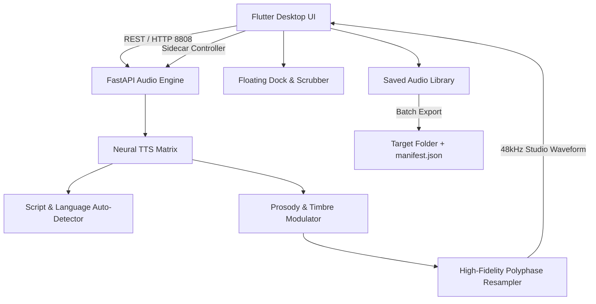

<p align="center">
  
</p>

<h1 align="center">infyn Vox</h1>

<p align="center">
  <strong>The Professional 48kHz Multilingual Desktop Audio Workstation & Neural Speech Synthesis Studio</strong>
</p>

<p align="center">
  <a href="https://github.com/imvicky69/infyn-vox/releases"></a>
  
  
  
  
  
  <a href="LICENSE"></a>
</p>

---

## ⚡ Direct Downloads (Windows x64)

Choose your preferred installation method from the official releases:

| Package | Format | File Size | Description | Link |
| :--- | :---: | :---: | :--- | :---: |
| **Windows Setup Installer** *(Recommended)* | `.exe` | **~12.7 MB** | Complete Windows wizard setup, Desktop & Start Menu shortcuts, uninstaller | [**Download Installer (.exe)**](https://github.com/imvicky69/infyn-vox/releases/latest) |
| **Portable Release Bundle** | `.zip` | **~14.3 MB** | Standalone portable zip — extract anywhere and launch immediately | [**Download Portable (.zip)**](https://github.com/imvicky69/infyn-vox/releases/latest) |

> **Prerequisites**: Windows 10 or 11 (64-bit), and Python 3.10+ installed for the local synthesis backend.

---

## ✨ Features & Capabilities

### 🎙️ 1. Studio Speech Synthesis (48kHz True Neural Master)
- **30+ Supported Languages**: Generate speech across English, Hindi, Mandarin, Japanese, Spanish, German, French, Arabic, and more with auto-script language detection.
- **Differentiated Acoustic Personas**:
  - **Elena & Swara**: Gentle, expressive narrative and documentary storytellers.
  - **Aria & Xiao Ya**: Crisp, modern voiceover artists with articulate cadence.
  - **David & Kabir**: Deep, resonant baritones for authoritative presentations.
  - **Leo & Kenji**: High-tempo tech podcasts and character acting.
- **Granular Controls**: Real-time adjustment of CFG Guidance scale, DiT Flow Steps, prosody modulation, pitch tuning, and random seeds.

### 📜 2. Smart Long-Form Narrative Segmenter
- Break multi-page scripts, video narration, and articles into natural sentence chunks without prosodic clipping.
- Stitch generated chunks into a seamless continuous audio master with realistic breathing pauses.
- **Auto-Synchronized Subtitles**: Automatically exports standard `.srt` subtitle files with millisecond precision for video editors.
- In-place voice template selector directly inside the segmenter.

### 🗄️ 3. Saved Audio Library & Batch "Export All"
- Centralized database of every synthesized clip and long-form master track.
- Live audio scrubber waveform synchronized with the floating studio playback dock.
- **One-Click Batch Exporter**: Pick any folder to export all audio tracks simultaneously with an auto-generated metadata `manifest.json`.

### 🎨 4. Swiss Monochrome Interface & Theme Switching
- Ultra-clean aesthetic inspired by Swiss typography: Deep Zinc 950 (`#09090B`) and Slate White (`#F8FAFC`).
- Signature **#3B82F6 Electric Blue** accenting.
- **Instant Light/Dark Theme Switcher** in the custom Windows title bar.
- Bundled **Geist** typography for readability.
- State preservation: active scripts, sliders, and playback state remain intact when switching tabs.

### 🔄 5. Integrated GitHub Releases Auto-Updater
- Checks `imvicky69/infyn-vox` for updates on launch.
- Displays changelog notes and provides direct one-click downloads.
- Enforces forced updates for critical neural model compatibility upgrades.

---

## 🏛️ System Architecture



---

## 🚀 Quick Start for Developers

### 1. Clone the Repository
```bash
git clone https://github.com/imvicky69/infyn-vox.git
cd infyn-vox
```

### 2. Setup the Python Synthesis Engine
```bash
cd backend
python -m venv venv
venv\Scripts\activate
pip install -r requirements.txt
python server.py --host 127.0.0.1 --port 8808
```

### 3. Launch the Flutter Desktop Client
```bash
# Return to root
cd ..

# Fetch dependencies & run
flutter pub get
flutter run -d windows
```

### 4. Build Production Executables
```bash
# Compile Flutter release binary
flutter build windows --release

# Compile Inno Setup Windows installer
& "C:\Program Files (x86)\Inno Setup 6\ISCC.exe" packaging\installer.iss
```

---

## 🤝 Contributing

We welcome contributions to infyn Vox! Follow these steps to contribute:

### Workflow
1. **Fork the Repository** on GitHub: `https://github.com/imvicky69/infyn-vox`.
2. **Create a Feature Branch**:
   ```bash
   git checkout -b feat/your-feature-name
   ```
3. **Make Your Changes**:
   - Adhere to Flutter and Dart style conventions (`dart format`).
   - Follow PEP 8 guidelines for backend Python code.
   - Keep the monochrome Swiss aesthetic (`AppTheme`) consistent.
4. **Run Verification & Tests**:
   ```bash
   flutter test
   dart analyze
   ```
5. **Commit Your Changes**:
   ```bash
   git commit -m "feat(module): description of changes"
   ```
6. **Push to Your Fork**:
   ```bash
   git push origin feat/your-feature-name
   ```
7. **Open a Pull Request** describing your changes and testing results.

### Reporting Issues
- Found a bug or have a feature idea? Open an issue on [GitHub Issues](https://github.com/imvicky69/infyn-vox/issues).
- Please include reproduction steps, logs from the Settings tab console, and system specifications.

---

## 📄 License

This project is licensed under the **MIT License** — see the [LICENSE](LICENSE) file for details.

---

<p align="center">
  Designed & Built with ❤️ for Creators, Voice Artists, and Sound Engineers.
</p>
